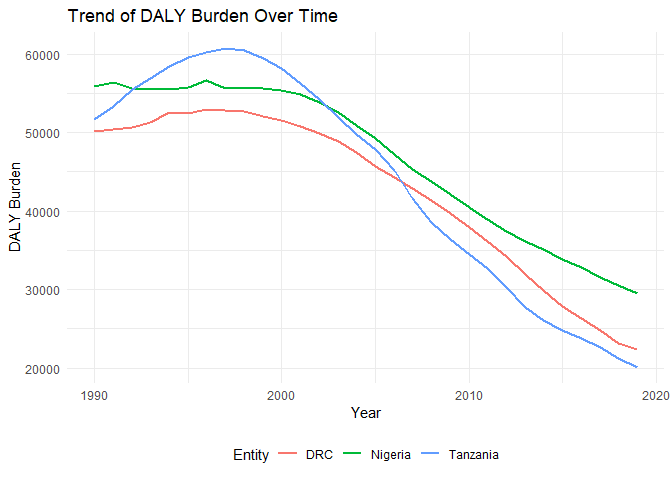
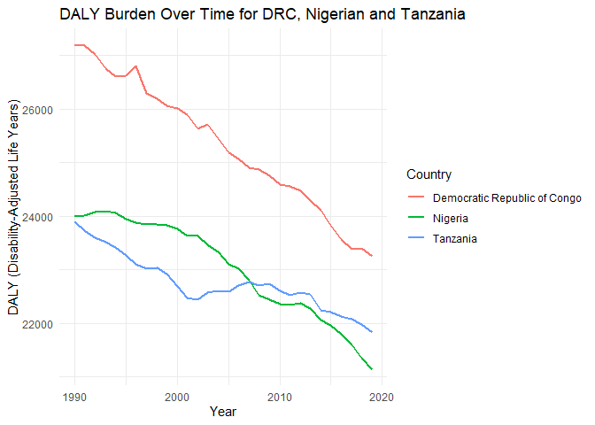
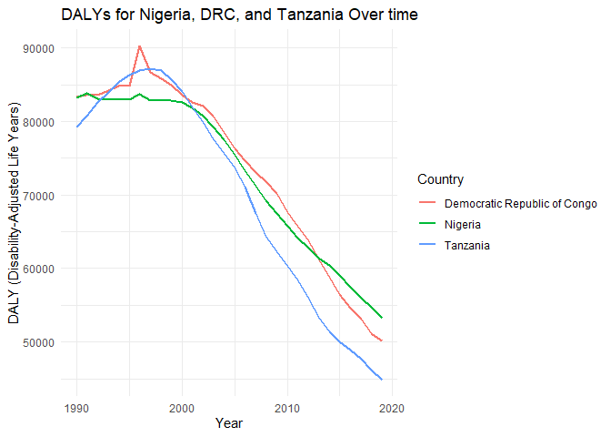

Global Disease Burden Analysis
================
REPLACE WITH THE AUTHOR NAMES

# Introduction

This document compares the Disability-Adjusted Life Year (DALY) diseases
burden for three countries: COUNTRY 1, COUNTRY 2, and COUNTRY 3. We
compare the burden due to communicable, maternal, neonatal, and
nutritional diseases (CMNN), non-communicable diseases (NCDs), and
overall disease burden for these countries.

The source data is from the Institute for Health Metrics and Evaluation
(IHME) Global Burden of Disease (GBD) study.

# Communicable, Maternal, Neonatal, and Nutritional Disease Burden (CMNN)

## Table of Estimates for CMNN Burden Over Time

| Year |      DRC |  Nigeria | Tanzania |
|-----:|---------:|---------:|---------:|
| 1990 | 50196.34 | 55858.01 | 51624.16 |
| 1991 | 50443.96 | 56402.61 | 53379.70 |
| 1992 | 50693.67 | 55584.80 | 55460.50 |
| 1993 | 51233.83 | 55462.25 | 56854.18 |
| 1994 | 52523.22 | 55563.10 | 58452.76 |
| 1995 | 52491.90 | 55778.38 | 59609.03 |
| 1996 | 52969.64 | 56608.97 | 60212.76 |
| 1997 | 52813.36 | 55670.89 | 60717.00 |
| 1998 | 52652.06 | 55633.69 | 60493.72 |
| 1999 | 52042.97 | 55610.97 | 59437.74 |
| 2000 | 51583.70 | 55309.83 | 58112.20 |
| 2001 | 50815.61 | 54828.09 | 56280.20 |
| 2002 | 49919.95 | 53795.58 | 54165.05 |
| 2003 | 48902.14 | 52594.17 | 51870.74 |
| 2004 | 47509.86 | 50933.61 | 49818.96 |
| 2005 | 45749.35 | 49195.49 | 47862.23 |
| 2006 | 44265.18 | 47222.66 | 45149.29 |
| 2007 | 42869.31 | 45320.76 | 41560.02 |
| 2008 | 41411.29 | 43735.33 | 38556.13 |
| 2009 | 39688.13 | 42069.10 | 36383.30 |
| 2010 | 37886.04 | 40429.09 | 34485.90 |
| 2011 | 36130.99 | 38900.83 | 32753.08 |
| 2012 | 34169.94 | 37432.21 | 30265.72 |
| 2013 | 31988.10 | 36186.87 | 27687.76 |
| 2014 | 29871.29 | 35085.94 | 26129.75 |
| 2015 | 27869.53 | 33891.85 | 24751.08 |
| 2016 | 26335.87 | 32791.92 | 23766.85 |
| 2017 | 24742.63 | 31579.39 | 22638.19 |
| 2018 | 23145.97 | 30540.72 | 21187.60 |
| 2019 | 22429.73 | 29467.82 | 20117.73 |

Table of Estimates for CMNN Burden Over Time

## Plot Showing Trends in CMNN Burden Over Time

<!-- -->

## Summary of CMNN Burden Findings

The DALYs were high for the three countries between 1990 and 2000.
However, in this time period Tanzania had the highest spike reaching
over 60,000 in 1997. The DALYs started to decline after the year 2000.

# **Non-Communicable Disease Burden (NCD)**

## Table of Estimates for NCD Burden Over Time

| year | Democratic Republic of Congo |  Nigeria | Tanzania |
|-----:|-----------------------------:|---------:|---------:|
| 1990 |                     27197.63 | 23994.43 | 23894.47 |
| 1991 |                     27182.46 | 24005.55 | 23723.87 |
| 1992 |                     27030.25 | 24073.41 | 23602.70 |
| 1993 |                     26753.36 | 24103.21 | 23521.63 |
| 1994 |                     26604.35 | 24068.17 | 23416.51 |
| 1995 |                     26626.30 | 23947.07 | 23267.82 |
| 1996 |                     26811.70 | 23875.00 | 23104.99 |
| 1997 |                     26288.57 | 23852.26 | 23025.48 |
| 1998 |                     26203.71 | 23844.55 | 23032.64 |
| 1999 |                     26062.03 | 23833.43 | 22921.56 |
| 2000 |                     26011.04 | 23763.60 | 22688.36 |
| 2001 |                     25900.36 | 23631.43 | 22483.26 |
| 2002 |                     25627.26 | 23629.69 | 22436.59 |
| 2003 |                     25720.73 | 23472.64 | 22566.95 |
| 2004 |                     25453.63 | 23329.15 | 22611.91 |
| 2005 |                     25191.03 | 23101.87 | 22586.85 |
| 2006 |                     25064.24 | 23016.59 | 22703.46 |
| 2007 |                     24898.60 | 22813.20 | 22770.30 |
| 2008 |                     24879.73 | 22528.84 | 22714.26 |
| 2009 |                     24762.25 | 22435.62 | 22740.12 |
| 2010 |                     24600.15 | 22360.91 | 22612.30 |
| 2011 |                     24556.86 | 22343.36 | 22526.33 |
| 2012 |                     24480.47 | 22376.80 | 22569.13 |
| 2013 |                     24300.22 | 22276.31 | 22540.78 |
| 2014 |                     24107.21 | 22064.38 | 22245.83 |
| 2015 |                     23827.81 | 21964.47 | 22218.38 |
| 2016 |                     23563.02 | 21802.05 | 22134.60 |
| 2017 |                     23384.56 | 21594.53 | 22080.68 |
| 2018 |                     23393.75 | 21350.80 | 21981.86 |
| 2019 |                     23259.95 | 21141.61 | 21835.44 |

DALY Burden Over Time for the Democratic Republic of Congo, Nigeria and
Tanzania

## Plot Showing Trends in NCD Burden Over Time

<!-- -->

## Summary of NCD Burden Findings

The DALY burden over time for Nigeria, Tanzania, and the DRC shows a
consistent decline across all three countries from 1990 to 2019. Nigeria
and Tanzania exhibit a more pronounced and steady reduction in DALY
rates, reflecting significant progress in managing non-communicable
diseases. The DRC, while also showing a downward trend, has a higher and
more fluctuating DALY burden, indicating ongoing challenges in improving
public health outcomes.

# Overall Disease Burden

\##Personal

## Table of Estimates for Overall Disease Burden Over Time

    ## # A tibble: 90 × 5
    ##    code   year `Democratic Republic of Congo` Nigeria Tanzania
    ##    <chr> <dbl>                          <dbl>   <dbl>    <dbl>
    ##  1 COD    1990                         83323.      NA       NA
    ##  2 COD    1991                         83534.      NA       NA
    ##  3 COD    1992                         83579.      NA       NA
    ##  4 COD    1993                         84212.      NA       NA
    ##  5 COD    1994                         84807.      NA       NA
    ##  6 COD    1995                         84849.      NA       NA
    ##  7 COD    1996                         90220.      NA       NA
    ##  8 COD    1997                         86665.      NA       NA
    ##  9 COD    1998                         85784.      NA       NA
    ## 10 COD    1999                         84962.      NA       NA
    ## # ℹ 80 more rows

| country                      | code | year |     daly |
|:-----------------------------|:-----|-----:|---------:|
| Democratic Republic of Congo | COD  | 1990 | 83323.46 |
| Democratic Republic of Congo | COD  | 1991 | 83534.47 |
| Democratic Republic of Congo | COD  | 1992 | 83579.16 |
| Democratic Republic of Congo | COD  | 1993 | 84212.14 |
| Democratic Republic of Congo | COD  | 1994 | 84807.08 |
| Democratic Republic of Congo | COD  | 1995 | 84848.66 |
| Democratic Republic of Congo | COD  | 1996 | 90220.16 |
| Democratic Republic of Congo | COD  | 1997 | 86664.90 |
| Democratic Republic of Congo | COD  | 1998 | 85784.02 |
| Democratic Republic of Congo | COD  | 1999 | 84961.69 |
| Democratic Republic of Congo | COD  | 2000 | 83639.74 |
| Democratic Republic of Congo | COD  | 2001 | 82609.63 |
| Democratic Republic of Congo | COD  | 2002 | 82098.45 |
| Democratic Republic of Congo | COD  | 2003 | 80679.08 |
| Democratic Republic of Congo | COD  | 2004 | 78468.77 |
| Democratic Republic of Congo | COD  | 2005 | 76324.96 |
| Democratic Republic of Congo | COD  | 2006 | 74640.68 |
| Democratic Republic of Congo | COD  | 2007 | 73064.95 |
| Democratic Republic of Congo | COD  | 2008 | 71799.47 |
| Democratic Republic of Congo | COD  | 2009 | 70163.14 |
| Democratic Republic of Congo | COD  | 2010 | 67626.27 |
| Democratic Republic of Congo | COD  | 2011 | 65691.85 |
| Democratic Republic of Congo | COD  | 2012 | 63729.20 |
| Democratic Republic of Congo | COD  | 2013 | 61311.53 |
| Democratic Republic of Congo | COD  | 2014 | 58836.46 |
| Democratic Republic of Congo | COD  | 2015 | 56520.17 |
| Democratic Republic of Congo | COD  | 2016 | 54665.84 |
| Democratic Republic of Congo | COD  | 2017 | 53162.10 |
| Democratic Republic of Congo | COD  | 2018 | 51196.74 |
| Democratic Republic of Congo | COD  | 2019 | 50113.59 |
| Nigeria                      | NGA  | 1990 | 83225.66 |
| Nigeria                      | NGA  | 1991 | 83782.38 |
| Nigeria                      | NGA  | 1992 | 83103.23 |
| Nigeria                      | NGA  | 1993 | 82991.49 |
| Nigeria                      | NGA  | 1994 | 82969.94 |
| Nigeria                      | NGA  | 1995 | 83026.21 |
| Nigeria                      | NGA  | 1996 | 83770.22 |
| Nigeria                      | NGA  | 1997 | 82829.75 |
| Nigeria                      | NGA  | 1998 | 82842.87 |
| Nigeria                      | NGA  | 1999 | 82873.98 |
| Nigeria                      | NGA  | 2000 | 82601.23 |
| Nigeria                      | NGA  | 2001 | 81850.25 |
| Nigeria                      | NGA  | 2002 | 80780.64 |
| Nigeria                      | NGA  | 2003 | 79278.81 |
| Nigeria                      | NGA  | 2004 | 77540.38 |
| Nigeria                      | NGA  | 2005 | 75379.06 |
| Nigeria                      | NGA  | 2006 | 73330.45 |
| Nigeria                      | NGA  | 2007 | 71176.37 |
| Nigeria                      | NGA  | 2008 | 69242.37 |
| Nigeria                      | NGA  | 2009 | 67483.05 |
| Nigeria                      | NGA  | 2010 | 65739.92 |
| Nigeria                      | NGA  | 2011 | 64174.38 |
| Nigeria                      | NGA  | 2012 | 62740.79 |
| Nigeria                      | NGA  | 2013 | 61468.45 |
| Nigeria                      | NGA  | 2014 | 60410.35 |
| Nigeria                      | NGA  | 2015 | 59034.54 |
| Nigeria                      | NGA  | 2016 | 57477.91 |
| Nigeria                      | NGA  | 2017 | 56018.08 |
| Nigeria                      | NGA  | 2018 | 54681.25 |
| Nigeria                      | NGA  | 2019 | 53229.60 |
| Tanzania                     | TZA  | 1990 | 79273.45 |
| Tanzania                     | TZA  | 1991 | 80768.11 |
| Tanzania                     | TZA  | 1992 | 82640.63 |
| Tanzania                     | TZA  | 1993 | 83908.09 |
| Tanzania                     | TZA  | 1994 | 85360.81 |
| Tanzania                     | TZA  | 1995 | 86297.41 |
| Tanzania                     | TZA  | 1996 | 86873.98 |
| Tanzania                     | TZA  | 1997 | 87144.86 |
| Tanzania                     | TZA  | 1998 | 86908.36 |
| Tanzania                     | TZA  | 1999 | 85691.95 |
| Tanzania                     | TZA  | 2000 | 84057.21 |
| Tanzania                     | TZA  | 2001 | 81988.07 |
| Tanzania                     | TZA  | 2002 | 79893.86 |
| Tanzania                     | TZA  | 2003 | 77666.55 |
| Tanzania                     | TZA  | 2004 | 75650.09 |
| Tanzania                     | TZA  | 2005 | 73645.37 |
| Tanzania                     | TZA  | 2006 | 71091.81 |
| Tanzania                     | TZA  | 2007 | 67543.71 |
| Tanzania                     | TZA  | 2008 | 64439.49 |
| Tanzania                     | TZA  | 2009 | 62312.52 |
| Tanzania                     | TZA  | 2010 | 60240.87 |
| Tanzania                     | TZA  | 2011 | 58427.44 |
| Tanzania                     | TZA  | 2012 | 55966.89 |
| Tanzania                     | TZA  | 2013 | 53340.93 |
| Tanzania                     | TZA  | 2014 | 51386.28 |
| Tanzania                     | TZA  | 2015 | 50012.14 |
| Tanzania                     | TZA  | 2016 | 48911.26 |
| Tanzania                     | TZA  | 2017 | 47725.68 |
| Tanzania                     | TZA  | 2018 | 46146.57 |
| Tanzania                     | TZA  | 2019 | 44863.07 |

DALYs for NIgeria, DRC, and Tanzania Over time

## Plot Showing Trends in Overall Disease Burden Over Time

<!-- -->

## Summary of Overall Disease Burden Findings

Provide a brief analysis based on the data presented in the table and
chart. Highlight any significant findings or patterns. About 3
sentences. DALYs had increased initially decreased from 1995 to 2020
with Tanzania being lower.
